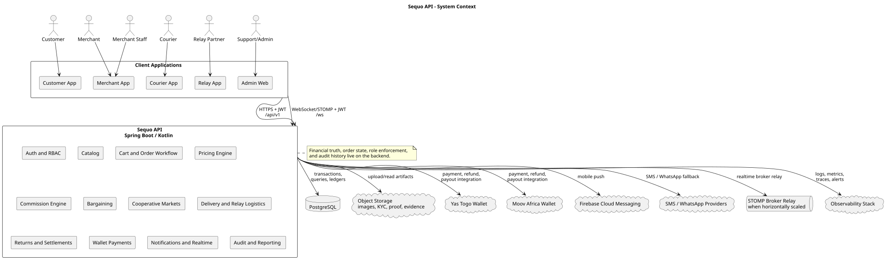

# Architecture

Sequo API should be built as a modular Spring Boot backend. The deployment unit can start as one service, but the codebase should be organized by domain boundaries so that pricing, settlement, wallets, logistics, and auth do not collapse into controller logic.

## Architectural Goals

- Keep all financial truth on the server.
- Keep all order and delivery state transitions explicit and auditable.
- Make pricing and commission calculations deterministic, versioned, and replayable.
- Enforce roles and ownership in backend policies, not only in client applications.
- Isolate wallet provider integrations behind adapters.
- Use ledger entries for money movement instead of mutating balances without traceability.
- Preserve operational IDs for orders, sub-orders, deposits, deliveries, returns, tours, and payouts.

## Runtime View



Source: [system-context.puml](docs/diagrams/plantuml/system-context.puml)

```text
Mobile/Web Clients
  Customer app
  Merchant app
  Courier app
  Relay app
  Admin web
        |
        | HTTPS + JWT
        | WebSocket/STOMP + JWT for active realtime clients
        v
Sequo API
  Auth and RBAC
  Catalog
  Cart and Order Workflow
  Pricing Engine
  Commission Engine
  Bargaining
  Cooperative Markets
  Delivery and Relay Logistics
  Returns and Settlements
  Wallet Payments
  Notifications and Realtime
  Audit and Reporting
        |
        +--> PostgreSQL
        +--> Object Storage
        +--> Yas Togo Wallet
        +--> Moov Africa Wallet
        +--> Firebase Cloud Messaging
        +--> SMS/WhatsApp Providers
        +--> STOMP broker relay when horizontally scaled
        +--> Observability Stack
```

## Recommended Package Layout

```text
src/main/kotlin/dev/orestegabo/sequo_api/
  SequoApiApplication.kt
  core/
    config/
    error/
    money/
    time/
    id/
    web/
  auth/
    api/
    application/
    domain/
    persistence/
    security/
  users/
  merchants/
  catalog/
  cooperatives/
  carts/
  orders/
  pricing/
  commissions/
  bargaining/
  delivery/
  relay/
  returns/
  wallets/
  settlements/
  notifications/
  audit/
  reporting/
  integrations/
    yas/
    moov/
    sms/
    push/
```

## Layering Rules

| Layer | Responsibility |
| --- | --- |
| API controllers | Validate transport shape, authenticate actor, call application services, map responses |
| Application services | Coordinate use cases, transactions, idempotency, event publication |
| Domain services | Enforce business rules, calculate money, validate transitions |
| Persistence adapters | Store and load aggregates, query projections, ledger records |
| Integration adapters | Speak to Yas Togo, Moov Africa, notification providers, storage |
| Background jobs | Retry webhooks, expire locks, schedule payouts, send notifications |

Controllers must not calculate prices, commissions, refunds, or payout balances. That logic belongs in domain services and must be covered by unit tests.

## Domain Boundaries

| Domain | Owns | Does not own |
| --- | --- | --- |
| Auth | Users, sessions, JWTs, refresh tokens, login events | Merchant KYC, wallet money movement |
| Users | Profiles, addresses, role assignments | Password/token verification |
| Merchants | Merchant accounts, staff, KYC, commission settings | Order settlement ledgers |
| Catalog | Products, variants, stock, delivery eligibility, bargaining toggle | Cart totals and order payment |
| Cooperatives | Cooperative grouping, member rules, consolidated package intent | Individual merchant payout execution |
| Carts | Draft baskets, selected delivery mode, checkout snapshot | Post-payment order truth |
| Orders | Order aggregate, order items, sub-orders, state transitions | Wallet provider callback verification |
| Pricing | Delivery fees, service fees, subscription discounts, loyalty multipliers | Merchant payout scheduling |
| Commissions | Merchant commission calculation, platform margin attribution | Refund disbursement execution |
| Bargaining | Offers, attempt counters, accepted price locks, historical minima | Product stock reservations |
| Delivery | Courier missions, pickup/drop-off, courier fee, proof, PIN validation | Wallet debit/credit |
| Relay | Point de Relai, lockers, parcel intake, return drop-off | Commission-rate configuration |
| Returns | Eligibility, return state, physical receipt, refund trigger | Wallet provider protocol details |
| Settlements | Ledgers, payouts, shortfalls, holds, reconciliation | Order item catalog editing |
| Wallets | Payment intents, provider callbacks, internal wallet balances | Order transition authorization |
| Notifications | FCM tokens, in-app notification history, delivery attempts, SMS fallback policy | Domain state changes |
| Realtime | WebSocket/STOMP sessions, topics, user queues, active client presence | Durable order/payment truth |
| Audit | Security, admin, financial, and support action history | Domain decision making |

## Key Aggregates

| Aggregate | Description |
| --- | --- |
| `UserAccount` | Login identity, status, profile, assigned roles |
| `Merchant` | Seller entity, commission rate, KYC state, payout preferences |
| `Product` | Merchant item, base price, platform margin, stock, delivery modes, bargaining toggle |
| `CooperativeMarket` | Group of merchants presented as a single market storefront |
| `Cart` | Customer draft before payment, can split into order/sub-order records |
| `Order` | Paid or confirmed purchase with immutable item and pricing snapshot |
| `BargainingSession` | Customer/seller negotiation context with attempt limits |
| `DeliveryMission` | Courier work unit with courier cost and delivery proof |
| `RelayParcel` | Parcel state inside a Point de Relai locker or intake flow |
| `ReturnRequest` | Customer return request, relay drop-off, physical receipt, refund decision |
| `WalletTransaction` | Provider or internal wallet money movement |
| `SettlementLedgerEntry` | Immutable accounting entry for commissions, payouts, refunds, holds, shortfalls |

## Order Workflow

Order workflows must be server-side state machines. Client apps can request transitions, but the API decides whether they are valid.

| State | Meaning | Common next states |
| --- | --- | --- |
| `DRAFT` | Customer is building a cart | `PRICE_QUOTED`, `ABANDONED` |
| `PRICE_QUOTED` | Server produced a priced checkout snapshot | `PAYMENT_PENDING`, `EXPIRED` |
| `PAYMENT_PENDING` | Wallet payment intent created | `PAID`, `PAYMENT_FAILED`, `CANCELLED` |
| `PAID` | Payment confirmed and order IDs generated | `MERCHANT_PENDING` |
| `MERCHANT_PENDING` | Merchant must accept or reject | `ACCEPTED`, `REJECTED`, `CANCELLED` |
| `ACCEPTED` | Merchant accepted | `PREPARING`, `CANCELLED_BY_SUPPORT` |
| `PREPARING` | Merchant is preparing goods | `READY_FOR_PICKUP`, `OUT_OF_STOCK`, `CANCELLED_BY_SUPPORT` |
| `READY_FOR_PICKUP` | Courier or relay can receive package | `IN_TRANSIT`, `RELAY_DEPOSITED`, `CUSTOMER_PICKUP_READY` |
| `IN_TRANSIT` | Courier has package | `DELIVERED`, `DELIVERY_PROBLEM`, `RELAY_DEPOSITED` |
| `DELIVERED` | Customer received package or delivery proof accepted | `RETURN_WINDOW_OPEN`, `SETTLEMENT_PENDING` |
| `RETURN_WINDOW_OPEN` | 72-hour return window is active for eligible goods | `RETURN_REQUESTED`, `SETTLEMENT_PENDING` |
| `RETURN_REQUESTED` | Customer opened return within 72 hours | `RETURN_DROPPED_AT_RELAY`, `RETURN_EXPIRED`, `RETURN_REJECTED` |
| `RETURN_RECEIVED` | Sequo physically received the item | `REFUND_PENDING`, `REFUND_REJECTED` |
| `REFUNDED` | Refund completed | `SETTLEMENT_ADJUSTED` |
| `SETTLED` | Merchant/courier payout ledger finalized | terminal |

## Bargaining Workflow

The bargaining state machine is independent from order payment until an accepted price is applied to checkout.

| State | Meaning |
| --- | --- |
| `OPEN` | Customer can submit an offer if attempts remain |
| `CUSTOMER_OFFERED` | Offer is pending merchant response |
| `MERCHANT_COUNTERED` | Merchant counter-offer is pending customer response |
| `ACCEPTED` | Accepted price can be used for 24 hours |
| `REJECTED` | Offer rejected, attempts may remain |
| `LOCKED_ATTEMPTS_EXHAUSTED` | 3 attempts reached for the customer/seller pair |
| `EXPIRED` | Pending offer or accepted price lock expired |

Accepted minimum prices must be stored historically even after the 24-hour checkout lock expires.

## Cooperative Market Flow

Cooperatives group independent merchants from the same market into one storefront. The backend must still preserve the true merchant owner for every product, item, sub-order, commission, refund, and payout.

Example: Marche de Mulhouse appears as one market storefront. A customer can buy from multiple member sellers. Sequo consolidates the package before delivery, but settlement is split by underlying seller.

Rules:

- Cooperative membership is admin-approved.
- Each product belongs to exactly one merchant, even when listed through a cooperative storefront.
- Checkout can produce one customer-facing package and multiple merchant sub-orders.
- Consolidation at Sequo creates a package manifest linking order items, merchant sub-orders, deposits, and delivery mission.
- Merchant payouts are calculated per member from their own sales, refund responsibility, and commission rate.

## Wallet and Payment Architecture

Wallets are provider-integrated and zero-cash:

- Yas Togo and Moov Africa are external wallet providers.
- Cash payment and cash withdrawal operations are outside backend scope.
- Provider callbacks must be signature-verified and idempotent.
- Payment intent state must be stored before redirect, push, or USSD flow.
- Wallet balances and provider references must be reconciled through ledger entries.
- Refunds execute only after return physical receipt or admin-approved exception.

## Data Consistency

Use database transactions around:

- Checkout pricing snapshot creation.
- Payment callback acceptance and order confirmation.
- Order state transition plus event/audit log.
- Bargaining offer acceptance and accepted-price lock creation.
- Return physical receipt and refund trigger.
- Settlement ledger posting and payout state changes.

Use an outbox table for side effects:

- Push/SMS notifications.
- Wallet provider calls that can be retried.
- Audit/event stream publishing.
- Payout batch notifications.

## ID Strategy

Human-readable operational IDs are separate from database primary keys.

| ID | Purpose |
| --- | --- |
| `CMD-YYYY-XXXXXX` | Customer-facing order |
| `SC-XXXXXX` | Merchant sub-order inside a multi-merchant order |
| `DEP-XXXXXX` | Deposit at Point de Relai or Sequo consolidation point |
| `LIV-YYYY-XXXXXX` | Delivery mission |
| `RET-YYYY-XXXXXX` | Return request |
| `TRN-YYYY-XXXXXX` | Scheduled tour or consolidation run |
| `PAY-YYYY-XXXXXX` | Payment intent |
| `SET-YYYY-XXXXXX` | Settlement batch or payout |

All operational IDs must be generated server-side, unique, immutable, and indexed.

## Observability

Minimum production telemetry:

- Request logs with request ID, actor ID, role, route, status, latency.
- Audit logs for login, role, admin, commission, refund, settlement, payout, and wallet actions.
- Metrics for order status counts, payment callback success, pricing errors, payout queue depth, return SLA, relay delays, provider latency.
- Alerts for stuck payments, duplicate callbacks, invalid wallet signatures, payout failures, return refunds older than SLA, relay parcels older than configured threshold.

## Deployment Assumptions

- HTTPS-only outside local development.
- PostgreSQL primary database.
- Object storage for product images, KYC files, proof photos, and return evidence.
- Separate local, staging, and production environments.
- Migrations run automatically in controlled deploy phases or explicitly in CI/CD.
- Production secrets come from a secret manager, not repository files.
