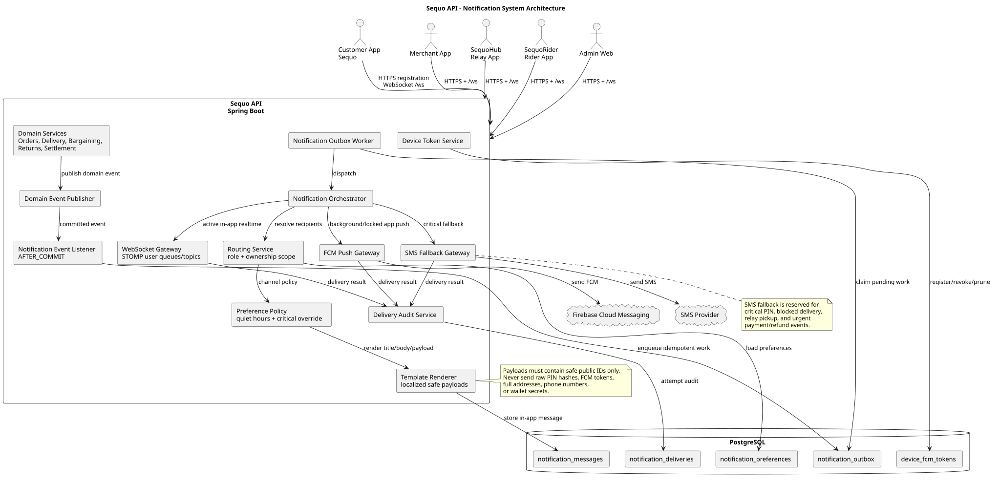
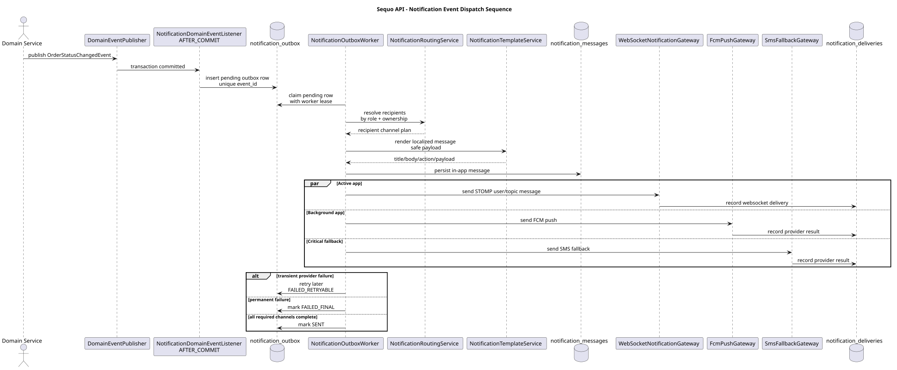

# Notification System

This document defines the notification architecture for `sequo-api`: push notifications, in-app notification history, SMS fallback for critical events, role-based routing, and event-driven dispatch from order, delivery, bargaining, return, wallet, and settlement workflows.

## Legacy Source Findings

The legacy folder at `/Users/muhirwagabooreste/AndroidStudioProjects/Sequo` contains product and architecture notes, but no production backend notification implementation.

Relevant legacy notes:

- `.env.example` contains `FCM_SERVER_KEY`, confirming Firebase Cloud Messaging was expected.
- `docs/TECHNICAL_README.md` lists push notifications as a backend need and names FCM/APNS/SMS credentials as environment groups.
- `docs/TASKS.md` marks notifications as TODO: push notifications plus SMS fallback for critical events.
- `docs/original/SEQUO_SERVICE_CAHIER_DE_CHARGE.md` requires critical SMS backup, PIN delivery by SMS/notification, client/admin alerts when deposits or tours are blocked, rider mission notifications, merchant return notifications, and merchant bargaining proposal notifications.
- `docs/original/CDC_SEQUO_v6.md` names in-app notifications plus SMS backup for important customer events such as order confirmation, rider en route, relay parcel availability, and refund completion.

Current backend rule: implement FCM as the primary mobile push channel, Spring WebSocket/STOMP for active in-app realtime updates, and SMS fallback only for critical events where push delivery cannot be trusted.

## Goals

- Route notifications differently for Customers, Merchants, Relay partners, Riders, Support, Admin, and Super Admin.
- Support four mobile app families:
  - Sequo customer app.
  - Merchant/seller app.
  - SequoHub Point de Relai app.
  - SequoRider delivery app.
- Send FCM push notifications for locked/background devices.
- Send WebSocket/STOMP messages for active app sessions.
- Store in-app notification history so missed realtime/push updates are recoverable.
- Trigger notifications from domain events, not controller side effects.
- Keep notification delivery auditable and idempotent.
- Avoid leaking private phone numbers, raw PIN hashes, exact addresses, payment secrets, or provider credentials.

## Non-Goals

- Do not use MQTT for the first production version.
- Do not send every low-value status as SMS.
- Do not make mobile clients responsible for deciding business-critical notification recipients.
- Do not trust client-submitted order status changes to trigger notifications without server-side validation.

## Architecture Overview



Source: [notification-system-architecture.puml](docs/diagrams/plantuml/notification-system-architecture.puml)

The backend should use the outbox pattern. Domain services publish events only after a successful transaction. A notification worker then resolves recipients, renders messages, stores in-app records, sends WebSocket messages to active clients, and sends FCM pushes for mobile devices.

## Current Implementation Snapshot

Implemented as of the current repository state:

- `V3__create_notification_tables.sql` creates `device_fcm_tokens`, `notification_preferences`, `notification_messages`, `notification_deliveries`, and `notification_outbox`.
- `DeviceTokenService` registers, rotates, revokes, and lists active FCM tokens per authenticated user/device/app family.
- FCM tokens are stored as a SHA-256 lookup hash plus AES-GCM protected ciphertext; raw FCM tokens must never be logged.
- `DeviceTokenController` exposes authenticated token registration at `POST /api/notifications/devices/fcm` and device revocation at `DELETE /api/notifications/devices/{appFamily}/{deviceId}`.
- `NotificationChannelPolicy` always creates an in-app path and uses WebSocket/FCM before considering paid SMS.
- SMS is not connected to a paid provider yet. The code only creates an SMS delivery work row for critical fallback cases when fallback is explicitly allowed, the user allows SMS, push is unavailable or failed, and budget remains.
- `NotificationDispatchService` persists idempotent in-app notification messages and planned delivery audit rows.
- Focused tests cover token encryption/rotation/revocation, channel cost policy, dispatch idempotency, and migration constraints.

Still pending:

- Firebase Admin SDK sender adapter.
- Spring WebSocket/STOMP runtime configuration.
- Notification outbox worker and `@TransactionalEventListener` hooks from order/delivery/return/settlement domains.
- Recipient routing by role, ownership, merchant scope, relay scope, rider assignment, and admin scope.
- In-app inbox read/list/archive endpoints.
- Real SMS provider abstraction, spend caps, and provider-level retry/dead-letter monitoring.

## Core Spring Components

| Component | Type | Responsibility |
| --- | --- | --- |
| `DomainEventPublisher` | Service/helper | Publish strongly typed domain events from order, delivery, bargaining, return, wallet, and settlement services. |
| `NotificationDomainEventListener` | `@TransactionalEventListener(phase = AFTER_COMMIT)` | Convert committed domain events into notification outbox records. |
| `NotificationOutboxRepository` | Repository | Persist pending notification work with idempotency keys and retry counters. |
| `NotificationOutboxWorker` | Scheduled/job worker | Claim pending outbox rows, execute delivery, retry failures, and dead-letter terminal failures. |
| `NotificationOrchestrator` | Service | High-level dispatch pipeline: route, preferences, template, persist, deliver, audit. |
| `NotificationRoutingService` | Service | Implemented foundation. Resolve event recipients by customer, merchant, relay, courier, support, admin, and super-admin scope; event listener integration remains. |
| `NotificationPreferenceService` | Service | Apply user/app/channel preferences, quiet hours, and critical override policy. |
| `NotificationTemplateService` | Service | Render localized title/body/action labels and construct safe payload data. |
| `DeviceTokenService` | Service | Implemented. Register, update, revoke, and prune FCM tokens per user/device/app. |
| `NotificationDispatchService` | Service | Implemented foundation. Persist idempotent messages and planned delivery audit rows using channel policy. |
| `NotificationChannelPolicy` | Service | Implemented foundation. Prefer in-app/WebSocket/FCM and suppress paid SMS unless critical fallback gates pass. |
| `FcmPushGateway` | Adapter | Send push notifications through Firebase Admin SDK. |
| `WebSocketNotificationGateway` | Adapter | Send active-session realtime messages through Spring STOMP. |
| `SmsFallbackGateway` | Adapter | Send critical fallback SMS through a provider abstraction. |
| `NotificationDeliveryAuditService` | Service | Record per-channel delivery attempts, provider references, failures, and retry state. |
| `NotificationReadService` | Service | Implemented foundation. List an owner's in-app notifications and mark them read, archived, or restored; HTTP API remains. |
| `NotificationMetrics` | Observability | Expose counters for sent, failed, retried, stale token, preference-suppressed, and SMS fallback. |

## Event-Driven Trigger Model



Source: [notification-event-dispatch-sequence.puml](docs/diagrams/plantuml/notification-event-dispatch-sequence.puml)

Domain services should publish events with stable event IDs.

```kotlin
data class OrderStatusChangedEvent(
    val eventId: UUID,
    val orderId: String,
    val customerId: String,
    val merchantIds: Set<String>,
    val oldStatus: String,
    val newStatus: String,
    val occurredAt: Instant,
)
```

Listeners must run after commit:

```kotlin
@TransactionalEventListener(phase = TransactionPhase.AFTER_COMMIT)
fun onOrderStatusChanged(event: OrderStatusChangedEvent) {
    notificationOutbox.enqueue(event)
}
```

Reasons:

- Avoid notifying about rolled-back state.
- Keep controllers clean.
- Centralize retry/idempotency.
- Make notification rules testable from domain event input.

## Notification Types

| Type | Audience | Push | WebSocket | SMS fallback | Notes |
| --- | --- | --- | --- | --- | --- |
| `ORDER_CREATED` | Merchant, customer | Yes | Yes | No | Customer gets confirmation; merchant gets actionable order alert. |
| `PAYMENT_CONFIRMED` | Customer, merchant/admin when needed | Yes | Yes | No | Payment must already be provider-confirmed. |
| `BARGAINING_PROPOSAL_CREATED` | Merchant | Yes | Yes | No | Merchant sees proposal and attempts used. |
| `BARGAINING_COUNTERED` | Customer | Yes | Yes | No | Customer sees counter-offer. |
| `BARGAINING_ACCEPTED` | Customer, merchant | Yes | Yes | No | Include 24-hour lock expiry. |
| `MERCHANT_ACCEPTED_ORDER` | Customer | Yes | Yes | No | Customer status moves to preparation. |
| `MERCHANT_REJECTED_ORDER` | Customer, support/admin | Yes | Yes | Optional | SMS only if refund/replacement action is critical. |
| `ORDER_PREPARING` | Customer | Optional | Yes | No | Realtime UI update can be enough when active. |
| `ORDER_READY_FOR_PICKUP` | Courier dispatch/admin | Yes | Yes | No | Create rider radar/mission update. |
| `RIDER_MISSION_OFFERED` | Rider | Yes | Yes | No | High priority for subscriber order or expiring mission offer. |
| `RIDER_ACCEPTED_MISSION` | Customer, merchant | Optional | Yes | No | Customer sees rider assigned. |
| `RIDER_PICKED_UP` | Customer | Yes | Yes | No | Customer tracking update. |
| `RIDER_ARRIVED` | Customer | Yes | Yes | Optional | SMS fallback when rider cannot reach customer or push failed. |
| `DIRECT_DELIVERED` | Customer, merchant | Optional | Yes | No | Opens return window and settlement flow. |
| `RELAY_PARCEL_DEPOSITED` | Customer, relay/admin | Yes | Yes | Yes | Customer receives pickup instructions and PIN via secure channel. |
| `RELAY_PICKUP_CODE_CREATED` | Customer | Yes | Yes | Yes | Critical because it gates parcel retrieval. |
| `RELAY_PARCEL_DELAYED` | Customer, admin, relay | Yes | Yes | Optional | Include fee/policy message only after policy is configured. |
| `RETURN_REQUESTED` | Merchant, customer, support | Yes | Yes | No | Merchant gets return notification. |
| `RETURN_PIN_CREATED` | Customer | Yes | Yes | Yes | Critical PIN event. |
| `RETURN_RECEIVED_BY_SEQUO` | Customer, merchant | Yes | Yes | No | Refund evaluation starts. |
| `REFUND_TRIGGERED` | Customer, finance/admin | Yes | Yes | Optional | SMS fallback for provider failure/manual action. |
| `MERCHANT_PAYOUT_ELIGIBLE` | Merchant, finance/admin | Optional | Yes | No | In-app/admin finance message. |
| `PAYOUT_SENT` | Merchant | Yes | Yes | No | Include provider reference only when safe. |
| `DELIVERY_PROBLEM_REPORTED` | Customer, support/admin | Yes | Yes | Optional | Critical if delivery blocked. |
| `MISSING_DEPOT_BLOCKED_TOUR` | Customer, admin, merchant | Yes | Yes | Optional | Legacy requires customer notification and admin alert. |

## Role Routing Matrix

| Event family | Customer | Merchant | Relay partner | Rider | Support/Admin |
| --- | --- | --- | --- | --- | --- |
| Checkout/payment | Confirmation, failure, retry | New paid order when relevant | No | No | Payment exception alerts |
| Merchant fulfillment | Accepted, preparing, ready, rejected | Own order task list | No | Ready package when dispatchable | SLA breach, rejection, cancellation |
| Bargaining | Counter, accepted, rejected, lock expiry | New proposal, customer accepted counter | No | No | Fraud/support escalations |
| Delivery mission | Rider assigned, picked up, arrived, delivered | Courier collected package | Relay-bound handoff only | Mission offer, assignment, route updates | Mission blocked, reassignment, no-show |
| Relay parcel | Parcel deposited, PIN, delayed, released | Return/deposit updates when owner | New parcel, release task, delayed parcel | Deposit confirmation | Delays, lost/damaged, locker issues |
| Returns/refunds | Return PIN, receipt, refund | Return requested, refund liability | Return drop-off task | Collection task if Sequo pickup | Dispute and refund alerts |
| Settlements | No | Payout eligible/sent/held | Relay payout if configured | Courier payout if configured | Batch failures, holds |

## FCM Device Token Management

Mobile apps must register their FCM token after login and whenever Firebase rotates it.

### Device Token Rules

- One user can have multiple devices.
- One physical device can change users after logout/login.
- Store token hash for lookup/deduplication; encrypt or protect raw token at rest if possible.
- Never log raw FCM tokens.
- Revoke tokens on logout, account suspension, or provider `UNREGISTERED`/`NOT_FOUND` response.
- Track app family so Sequo customer app does not receive SequoRider-only notifications.
- Track platform, app version, locale, timezone, and last-seen timestamp for routing and debugging.

### Required API

| Method | Path | Auth | Purpose |
| --- | --- | --- | --- |
| `POST` | `/api/notifications/devices/fcm` | User | Implemented. Register or rotate FCM token for the current app/device. |
| `DELETE` | `/api/notifications/devices/{appFamily}/{deviceId}` | Device owner | Implemented. Revoke one device token, usually on logout. |
| `DELETE` | `/api/v1/users/me/devices` | User | Future. Revoke all own devices. |
| `GET` | `/api/v1/users/me/notification-preferences` | User | Read channel preferences and quiet hours. |
| `PATCH` | `/api/v1/users/me/notification-preferences` | User | Update non-critical preferences. |
| `GET` | `/api/v1/users/me/notifications` | User | In-app notification inbox. |
| `POST` | `/api/v1/users/me/notifications/{notificationId}/read` | User | Mark notification as read. |
| `POST` | `/api/v1/admin/notifications/test` | Admin | Send a sandbox/test notification. Disabled in production unless explicitly configured. |

### Device Registration Payload

```json
{
  "deviceId": "android-secure-installation-id",
  "fcmToken": "raw-token-from-firebase",
  "appFamily": "SEQUO_RIDER",
  "platform": "ANDROID",
  "appVersion": "1.8.0",
  "locale": "fr-TG",
  "timezone": "Africa/Lome"
}
```

## Database Schema

### `device_fcm_tokens`

| Column | Notes |
| --- | --- |
| `id` | UUID primary key |
| `user_id` | FK `users.id` |
| `device_id` | Client installation/device reference |
| `app_family` | `SEQUO_CUSTOMER`, `SEQUO_MERCHANT`, `SEQUO_HUB`, `SEQUO_RIDER`, `SEQUO_ADMIN` |
| `platform` | `ANDROID`, `IOS`, `WEB` |
| `fcm_token_hash` | Unique hash for dedupe and lookup |
| `fcm_token_ciphertext` | Raw token encrypted/protected for provider send |
| `app_version` | Last registered app version |
| `locale`, `timezone` | Routing/template hints |
| `status` | `ACTIVE`, `REVOKED`, `STALE`, `FAILED` |
| `last_seen_at` | Updated by registration/heartbeat |
| `revoked_at` | Nullable |
| `created_at`, `updated_at` | Timestamps |

Unique constraints:

- `fcm_token_hash`.

Indexes:

- `(user_id, app_family, status)`.
- `(user_id, device_id, app_family, status)`.

Rotation rule: keep revoked token history for audit/debugging, so `(user_id, device_id, app_family)` is indexed but not unique.

### `notification_preferences`

| Column | Notes |
| --- | --- |
| `id` | UUID primary key |
| `user_id` | FK |
| `app_family` | App-specific preferences |
| `event_type` | Specific event or `ALL` |
| `push_enabled` | Boolean |
| `in_app_enabled` | Boolean |
| `sms_enabled` | Boolean for user-allowed non-critical SMS |
| `quiet_hours_start`, `quiet_hours_end` | Nullable local-time range |
| `created_at`, `updated_at` | Timestamps |

Critical events can override preference suppression for legal/operational safety, but this must be explicit in policy and audited.

### `notification_messages`

| Column | Notes |
| --- | --- |
| `id` | UUID primary key |
| `event_id` | Domain event ID |
| `recipient_user_id` | FK |
| `app_family` | Target app |
| `event_type` | Stable notification type |
| `severity` | `INFO`, `ACTION_REQUIRED`, `URGENT`, `SECURITY`, `FINANCIAL` |
| `title` | Rendered localized title |
| `body` | Rendered localized body |
| `action_url` | Deep link or app route |
| `payload` | JSONB with safe public IDs only |
| `read_at`, `archived_at` | Nullable |
| `created_at` | Timestamp |

Unique: `(event_id, recipient_user_id, app_family, event_type)`.

### `notification_deliveries`

| Column | Notes |
| --- | --- |
| `id` | UUID primary key |
| `message_id` | FK `notification_messages.id` |
| `channel` | `IN_APP`, `FCM`, `WEBSOCKET`, `SMS`, `EMAIL`, `WHATSAPP` |
| `target_ref` | Token hash, user destination, or masked phone reference |
| `status` | `PENDING`, `SENT`, `FAILED_RETRYABLE`, `FAILED_FINAL`, `SUPPRESSED` |
| `provider_reference` | Nullable |
| `failure_code`, `failure_message` | Nullable, user-safe |
| `attempt_count` | Integer |
| `next_attempt_at` | Nullable |
| `sent_at`, `created_at`, `updated_at` | Timestamps |

### `notification_outbox`

| Column | Notes |
| --- | --- |
| `id` | UUID primary key |
| `event_id` | Domain event ID |
| `event_type` | Stable domain event type |
| `aggregate_type`, `aggregate_id` | Order, delivery mission, return, settlement, etc. |
| `payload` | JSONB event payload |
| `status` | `PENDING`, `PROCESSING`, `SENT`, `FAILED_RETRYABLE`, `FAILED_FINAL` |
| `attempt_count` | Integer |
| `next_attempt_at` | Nullable |
| `locked_by`, `locked_until` | Nullable worker lease |
| `created_at`, `updated_at`, `processed_at` | Timestamps |

Indexes:

- `device_fcm_tokens(user_id, app_family, status)`.
- `device_fcm_tokens(user_id, device_id, app_family, status)`.
- `notification_messages(recipient_user_id, created_at desc)`.
- `notification_messages(event_id, recipient_user_id, app_family, event_type) unique`.
- `notification_deliveries(message_id, channel, status)`.
- `notification_outbox(status, next_attempt_at)`.
- `notification_outbox(event_id) unique`.

## FCM Payload Policy

Use data payloads for app routing and optionally notification payloads for visible system tray messages.

Recommended FCM data:

```json
{
  "eventId": "evt_01J...",
  "type": "RIDER_ARRIVED",
  "severity": "URGENT",
  "orderId": "CMD-2026-0001",
  "deliveryMissionId": "LIV-2026-0001",
  "deeplink": "sequo://orders/CMD-2026-0001/tracking",
  "createdAt": "2026-08-02T13:00:00Z"
}
```

Rules:

- Include public IDs, not internal UUIDs unless the mobile app needs them and authorization protects follow-up API calls.
- Do not include raw PIN hashes, wallet references, full address, phone numbers, or payment secrets.
- For PIN events, send a user-visible message and require the app to fetch/confirm the latest secure instruction from the API when opened.
- Use higher FCM priority only for urgent delivery/mission/PIN events.
- Collapse low-value status updates by order ID where safe; never collapse PIN or financial events.

## SMS Fallback Policy

SMS is more expensive and less private than push, so use it only for critical events:

- Pickup/delivery/return PIN created.
- Relay parcel ready for pickup.
- Rider arrived and push failed or customer is unreachable.
- Delivery blocked or postponed.
- Refund/payment action requiring user attention.
- Security-sensitive account event if required by auth policy.

Fallback trigger examples:

- No active device token for required recipient.
- FCM returned stale/unregistered for every active token.
- Notification remains undelivered after configured retry window.
- Event policy explicitly requires SMS and user phone is verified.

Implemented cost gate:

```kotlin
SMS is planned only when:
event is critical
AND smsFallbackAllowed == true
AND userSmsEnabled == true
AND smsBudgetRemaining > 0
AND (no active FCM token OR FCM delivery already failed)
```

This keeps local development and early production from spending money on SMS for normal order progress updates.

## Security And Privacy

- All notification APIs require authentication.
- Admin test notification API must be disabled or restricted in production.
- Device token registration must bind token to authenticated user.
- Revoke tokens on logout and account suspension.
- Never expose another merchant's, relay's, or rider's notifications.
- Never log raw FCM tokens, raw SMS phone numbers, raw PINs, or full address payloads.
- WebSocket subscriptions must be authorized independently from HTTP auth.
- Notification payloads must be safe if visible on a locked phone.
- User preferences cannot suppress legally/security-critical notifications unless policy allows.

## Reliability Rules

- Use outbox records for all domain-triggered notifications.
- Every delivery attempt has an idempotency key.
- Retry transient provider errors with exponential backoff.
- Mark stale FCM tokens inactive on provider stale-token errors.
- Dead-letter permanently failing messages for admin review.
- Reconcile notification delivery metrics daily.
- Keep templates versioned so old audit rows remain understandable.

## Testing Expectations

- Routing tests for customer, merchant, rider, relay, support, admin.
- Preference suppression tests.
- Critical override tests.
- FCM stale token pruning tests.
- Outbox retry/idempotency tests.
- WebSocket active-session delivery tests.
- SMS fallback trigger tests.
- Payload privacy tests to prevent full addresses, phone numbers, raw PINs, wallet secrets, and FCM tokens from being logged or delivered.

## Implementation Order

1. [x] Add migrations for `device_fcm_tokens`, `notification_preferences`, `notification_messages`, `notification_deliveries`, and `notification_outbox`.
2. [x] Implement `DeviceTokenService` and authenticated device token APIs.
3. [x] Implement token hash/encryption protection for FCM tokens at rest.
4. [x] Implement notification channel cost policy and delivery planning foundation.
5. [ ] Add notification dependencies: Firebase Admin SDK, Spring WebSocket, validation, and optional scheduler lock library.
6. [ ] Implement notification outbox worker and `NotificationDomainEventListener`.
7. [x] Implement domain `NotificationRoutingService` for customer, merchant, rider, relay, support, and admin scopes. Wire it to committed domain events in the next integration step.
8. [ ] Implement WebSocket/STOMP infrastructure from [WEBSOCKET_ARCHITECTURE.md](WEBSOCKET_ARCHITECTURE.md).
9. [ ] Implement FCM sender adapter and provider delivery audit.
10. [ ] Add SMS fallback provider abstraction for critical events with monthly spend caps and provider-level rate limits.
11. [ ] Wire notification triggers into order, merchant fulfillment, delivery mission, relay parcel, bargaining, return, refund, and settlement services.
12. [ ] Add admin monitoring for failed deliveries, stale tokens, SMS fallback usage, and dead-lettered notifications.
