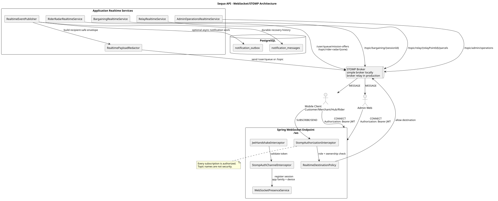
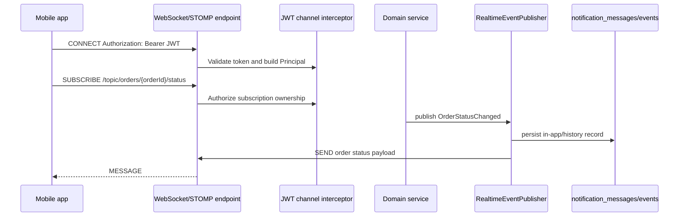
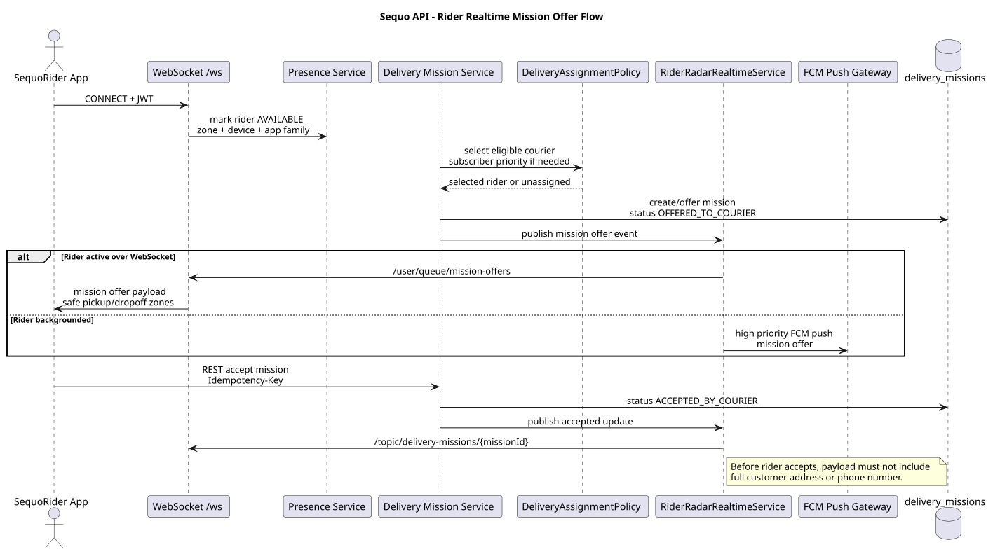

# WebSocket Architecture

This document defines the Spring WebSocket/STOMP realtime architecture for `sequo-api`. It complements [NOTIFICATION_SYSTEM.md](NOTIFICATION_SYSTEM.md): WebSockets are for active in-app updates, while FCM handles background/locked mobile state.

## Goals

- Deliver realtime UI updates without heavy polling.
- Support Sequo customer, merchant, SequoHub relay, SequoRider, support, and admin clients.
- Use Spring WebSocket with STOMP, not MQTT, for the first backend implementation.
- Secure subscriptions with JWT authentication and role/ownership checks.
- Support live rider mission radars, active bargaining updates, order status changes, relay parcel updates, and admin operations dashboards.
- Make reconnect recovery deterministic through durable notification/event history.

## Transport Decision

| Option | Decision | Reason |
| --- | --- | --- |
| HTTP polling | Avoid for live flows | Too heavy for rider radar, bargaining, and status updates. |
| MQTT | Not first version | More operational complexity and another auth surface. |
| Server-Sent Events | Not enough | One-way only; STOMP gives client commands and subscriptions. |
| Spring WebSocket/STOMP | Use | Good Spring integration, user destinations, topic routing, mobile support. |

## High-Level Flow



Source: [websocket-stomp-architecture.puml](docs/diagrams/plantuml/websocket-stomp-architecture.puml)



## Spring Configuration

Required dependencies:

- `spring-boot-starter-websocket`
- `spring-security-messaging`
- `spring-boot-starter-validation`

Recommended production option for horizontal scale:

- Use Spring's STOMP broker relay with RabbitMQ or another broker when multiple API instances need shared subscriptions.
- Use the simple in-memory broker only for local development and early MVP.

Suggested config class:

```kotlin
@Configuration
@EnableWebSocketMessageBroker
class WebSocketConfig(
    private val jwtHandshakeInterceptor: JwtHandshakeInterceptor,
    private val stompAuthChannelInterceptor: StompAuthChannelInterceptor,
) : WebSocketMessageBrokerConfigurer {
    override fun registerStompEndpoints(registry: StompEndpointRegistry) {
        registry.addEndpoint("/ws")
            .setAllowedOriginPatterns("https://*.sequo.app")
            .addInterceptors(jwtHandshakeInterceptor)
    }

    override fun configureMessageBroker(config: MessageBrokerRegistry) {
        config.setApplicationDestinationPrefixes("/app")
        config.enableSimpleBroker("/topic", "/queue")
        config.setUserDestinationPrefix("/user")
    }

    override fun configureClientInboundChannel(registration: ChannelRegistration) {
        registration.interceptors(stompAuthChannelInterceptor)
    }
}
```

Production notes:

- Replace `enableSimpleBroker` with `enableStompBrokerRelay` when clustering.
- Configure heartbeat intervals.
- Enforce allowed origins.
- Limit message size.
- Require TLS outside local development.

## Authentication

Clients must authenticate during `CONNECT`.

Supported token locations:

- `Authorization: Bearer <access_token>` STOMP native header.
- Query parameter only for constrained clients, and only over TLS.

Components:

| Component | Responsibility |
| --- | --- |
| `JwtHandshakeInterceptor` | Extract token during initial upgrade if needed. |
| `StompAuthChannelInterceptor` | Validate `CONNECT`, attach authenticated Principal, reject invalid tokens. |
| `StompAuthorizationService` | Check whether the user can subscribe/send to a destination. |
| `WebSocketPresenceService` | Track online users, app family, roles, device ID, and last heartbeat. |
| `WebSocketRateLimiter` | Limit subscribe/send bursts by user/device/IP hint. |

Token rules:

- Use short-lived access tokens.
- Reject revoked/expired tokens.
- Reconnect after token refresh.
- Never allow anonymous subscriptions except public health/dev channels.

## Authorization Rules

STOMP subscription authorization must be as strict as REST API authorization.

| Destination | Required authorization |
| --- | --- |
| `/user/queue/notifications` | Authenticated current user only. |
| `/topic/orders/{orderId}/status` | Customer owner, involved merchant, assigned rider, related relay, support/admin. |
| `/topic/merchant/{merchantId}/orders` | Merchant owner/staff scoped to that merchant, support/admin. |
| `/topic/delivery-missions/{missionId}` | Assigned/offered rider, support/admin, involved merchant for pickup-safe fields. |
| `/topic/rider-radar/{zone}` | Rider available in zone, dispatch/admin. Payload must hide private customer fields until assignment. |
| `/topic/bargaining/{sessionId}` | Customer participant, merchant participant, support/admin. |
| `/topic/relay/{relayPointId}/parcels` | Relay partner scoped to relay point, support/admin. |
| `/topic/admin/operations` | Admin/support only. |
| `/app/*` send endpoints | Authenticated and role-authorized; server validates every command. |

Important: topic names can expose identifiers. Use public operational IDs, not internal UUIDs, when possible. Even with opaque IDs, always authorize subscription.

## Destination Map

### User Queues

| Destination | Recipient | Purpose |
| --- | --- | --- |
| `/user/queue/notifications` | Any authenticated user | In-app notification feed updates. |
| `/user/queue/errors` | Any authenticated user | User-safe command errors. |
| `/user/queue/order-events` | Customer | Own active order status updates. |
| `/user/queue/mission-offers` | Rider | Mission offers, including high-priority subscriber orders. |
| `/user/queue/relay-tasks` | Relay partner | Parcel deposit/release tasks for assigned relay. |

### Topics

| Topic | Purpose | Notes |
| --- | --- | --- |
| `/topic/orders/{orderId}/status` | Order lifecycle status changes. | Authorized participants only. |
| `/topic/merchant/{merchantId}/orders` | Merchant live order queue. | New order, accepted, preparing, ready, rejected. |
| `/topic/bargaining/{sessionId}` | Active bargaining proposals/counters. | Customer and merchant participants only. |
| `/topic/delivery-missions/{missionId}` | Mission state changes. | Rider/admin; limited merchant/customer payloads. |
| `/topic/rider-radar/{zone}` | Live rider radar/offer feed. | Avoid leaking addresses before mission acceptance. |
| `/topic/relay/{relayPointId}/parcels` | Relay parcel state. | Relay-scoped. |
| `/topic/admin/operations` | Admin live operations board. | Aggregated metrics and incidents. |
| `/topic/admin/settlements` | Finance/admin settlement updates. | Financial role required. |

### Client Commands

Use `/app` only for commands that need immediate realtime semantics. REST remains the default for durable workflow mutations.

| Client sends to | Purpose | Server effect |
| --- | --- | --- |
| `/app/rider/availability` | Rider available/unavailable toggle. | Validates rider role and updates presence/availability. |
| `/app/rider/radar/subscribe` | Rider declares active zone. | Validates eligibility, joins radar topic or user queue. |
| `/app/bargaining/{sessionId}/typing` | Optional typing/active signal. | Ephemeral message to other participant. |
| `/app/orders/{orderId}/watch` | Optional active order watch. | Validates ownership and registers active interest. |

Workflow-changing actions such as accepting orders, accepting missions, pickup, delivery, relay release, refund, and payout should remain REST commands first. REST persists the state, emits domain events, then WebSocket broadcasts the result.

## Message Envelope

Every realtime message should use a stable envelope.

```json
{
  "eventId": "evt_01J...",
  "type": "ORDER_STATUS_CHANGED",
  "version": 1,
  "occurredAt": "2026-08-02T13:00:00Z",
  "subject": {
    "type": "ORDER",
    "id": "CMD-2026-0001"
  },
  "visibility": "CUSTOMER",
  "sequence": 4512,
  "payload": {}
}
```

Rules:

- `eventId` is globally unique and idempotent.
- `sequence` is monotonic per recipient or per aggregate, when possible.
- `visibility` controls payload redaction.
- `payload` must be safe for the recipient role.
- Clients ignore duplicate `eventId`.
- Clients recover missed messages through REST on reconnect.

## Payload Examples

### Order Status

```json
{
  "eventId": "evt_order_ready_1",
  "type": "ORDER_STATUS_CHANGED",
  "version": 1,
  "occurredAt": "2026-08-02T13:10:00Z",
  "subject": { "type": "ORDER", "id": "CMD-2026-0001" },
  "visibility": "CUSTOMER",
  "sequence": 91,
  "payload": {
    "status": "READY_FOR_PICKUP",
    "label": "Your order is ready for rider pickup.",
    "nextAction": "TRACK_DELIVERY"
  }
}
```

### Rider Mission Offer

```json
{
  "eventId": "evt_mission_offer_1",
  "type": "RIDER_MISSION_OFFERED",
  "version": 1,
  "occurredAt": "2026-08-02T13:12:00Z",
  "subject": { "type": "DELIVERY_MISSION", "id": "LIV-2026-0001" },
  "visibility": "RIDER_OFFER",
  "sequence": 44,
  "payload": {
    "priority": "SUBSCRIBER",
    "pickupNeighborhood": "Tokoin",
    "dropoffNeighborhood": "Agoe",
    "expiresAt": "2026-08-02T13:14:00Z"
  }
}
```

Do not include full customer address or phone number before the rider accepts and is authorized.

### Bargaining Update

```json
{
  "eventId": "evt_bargain_counter_1",
  "type": "BARGAINING_COUNTERED",
  "version": 1,
  "occurredAt": "2026-08-02T13:15:00Z",
  "subject": { "type": "BARGAINING_SESSION", "id": "BARG-2026-0001" },
  "visibility": "PARTICIPANT",
  "sequence": 12,
  "payload": {
    "status": "MERCHANT_COUNTERED",
    "attemptsRemaining": 2,
    "expiresAt": "2026-08-02T13:45:00Z"
  }
}
```

### Relay Parcel Update

```json
{
  "eventId": "evt_relay_deposit_1",
  "type": "RELAY_PARCEL_DEPOSITED",
  "version": 1,
  "occurredAt": "2026-08-02T13:30:00Z",
  "subject": { "type": "RELAY_PARCEL", "id": "DEP-2026-0001" },
  "visibility": "CUSTOMER",
  "sequence": 31,
  "payload": {
    "relayName": "SequoHub Tokoin",
    "pickupWindowLabel": "Available for pickup today",
    "requiresCode": true
  }
}
```

## Reconnect And Missed Events

WebSocket is not durable by itself. The backend must persist important messages.

Client reconnect flow:

1. Refresh access token if needed.
2. Connect to `/ws`.
3. Subscribe to user queues and active aggregate topics.
4. Call REST endpoint `GET /api/v1/realtime/events?afterSequence=<lastSeen>` or `GET /api/v1/users/me/notifications?since=<timestamp>`.
5. Apply missed messages by `sequence` and ignore duplicate `eventId`.

Required REST recovery endpoints:

| Method | Path | Auth | Purpose |
| --- | --- | --- | --- |
| `GET` | `/api/v1/realtime/events` | User | Fetch missed realtime events by cursor/sequence. |
| `GET` | `/api/v1/users/me/notifications` | User | Fetch durable in-app notification history. |

## FCM And WebSocket Coordination

The same domain event can produce both a WebSocket message and an FCM push.

Policy:

- If user has active WebSocket session in the target app family, send WebSocket immediately.
- Still store in-app message for important events.
- Send FCM for background/locked states and urgent events.
- Suppress noisy FCM for active foreground clients when the event is low priority.
- Use the same `eventId` so clients dedupe foreground and push-open flows.

Examples:

| State | Channel decision |
| --- | --- |
| Customer active on order tracking screen | WebSocket + in-app store; no FCM for low-priority status. |
| Customer backgrounded when rider arrives | FCM urgent + in-app store; SMS fallback if critical and push fails. |
| Rider app active in radar | WebSocket mission offer + optional FCM if high-priority subscriber order. |
| Merchant app locked | FCM new order/bargaining proposal + in-app store. |
| Relay app active | WebSocket parcel task + in-app store. |

## Presence And Rider Radar



Source: [rider-realtime-mission-flow.puml](docs/diagrams/plantuml/rider-realtime-mission-flow.puml)

Rider radar should not be a public topic of all orders. It must be filtered server-side.

Rider presence fields:

- `user_id`
- `courier_id`
- `app_family = SEQUO_RIDER`
- `availability = AVAILABLE | BUSY | UNAVAILABLE`
- `zone`
- `last_heartbeat_at`
- `active_mission_id`
- `device_id`

Radar dispatch rules:

- Only available verified riders receive mission offers.
- Subscriber/high-priority orders can prefer salaried Sequo delivery capacity before freelancers.
- One mission offer at a time for MVP.
- Mission offer has expiry.
- If rider rejects or times out, reassign and notify next eligible rider.
- Payload before acceptance must show only safe pickup/drop-off neighborhood and operational distance, not private customer details.

## Bargaining Realtime Rules

- Bargaining messages are participant-only.
- Every offer/counter/accept/reject is persisted by REST/domain service before WebSocket broadcast.
- Typing/active signals may be ephemeral WebSocket-only.
- Attempt counts and lock expiry are included in updates.
- Merchant receives FCM for a new customer proposal when not active.

## Relay Realtime Rules

- Relay partners subscribe only to their assigned relay point topics.
- Parcel release requires server-side validation of pickup code/QR and identity validation.
- The customer receives WebSocket/FCM when a relay parcel is deposited and when it becomes delayed.
- Admin/support receives realtime alerts for lost/damaged parcels, delayed parcels, identity mismatch, and missing deposits.

## Admin Operations Realtime

Admin dashboards can subscribe to aggregated topics:

- `/topic/admin/operations`
- `/topic/admin/delivery-capacity`
- `/topic/admin/relay-delays`
- `/topic/admin/settlements`

Admin payloads should be aggregated by default. Detailed PII requires explicit REST fetch with admin audit.

## Security Checklist

- [ ] JWT required on `CONNECT`.
- [ ] Origin restrictions configured.
- [ ] Subscription authorization for every topic pattern.
- [ ] User destinations used for private messages where possible.
- [ ] Role and ownership checks match REST API checks.
- [ ] Payload redaction by recipient role.
- [ ] Heartbeats configured.
- [ ] Message size limits configured.
- [ ] Rate limits for connect/subscribe/send.
- [ ] Audit suspicious subscription denials.
- [ ] Never send raw PIN hashes, FCM tokens, full phone numbers, wallet secrets, or full addresses.

## Suggested Classes

| Class | Responsibility |
| --- | --- |
| `WebSocketConfig` | STOMP endpoint and broker config. |
| `JwtHandshakeInterceptor` | Extract JWT during handshake. |
| `StompAuthChannelInterceptor` | Authenticate `CONNECT` and attach Principal. |
| `StompAuthorizationInterceptor` | Authorize `SUBSCRIBE` and `SEND` destinations. |
| `RealtimeDestinationPolicy` | Map destination patterns to role/ownership requirements. |
| `RealtimeEventPublisher` | Convert domain notification events into STOMP messages. |
| `RealtimePayloadRedactor` | Produce recipient-safe payload variants. |
| `WebSocketPresenceService` | Track connected users/devices/app family/availability. |
| `RiderRadarRealtimeService` | Publish filtered rider mission offers. |
| `BargainingRealtimeService` | Publish bargaining updates to participants. |
| `RelayRealtimeService` | Publish relay parcel tasks and delayed alerts. |
| `AdminOperationsRealtimeService` | Publish aggregated operations dashboard updates. |

## Testing Expectations

- `CONNECT` rejects invalid/expired JWT.
- User can subscribe to own `/user/queue/notifications`.
- Customer cannot subscribe to another customer's order topic.
- Merchant staff cannot subscribe to another merchant's order topic.
- Rider cannot subscribe to another rider's mission after assignment.
- Relay partner cannot subscribe to another relay point.
- Admin can subscribe to admin operations.
- Payload redaction hides full address/phone before rider acceptance.
- Duplicate event IDs are sent once per recipient.
- Reconnect recovery returns missed events.
- FCM/WebSocket dedupe uses the same `eventId`.

## Implementation Order

1. Add WebSocket dependencies and `WebSocketConfig`.
2. Implement JWT `CONNECT` authentication.
3. Implement subscription authorization for user queue, order, merchant, mission, bargaining, relay, and admin topics.
4. Implement `RealtimeEventPublisher` with a typed envelope.
5. Add user notification queue support.
6. Add order status and merchant order topic updates.
7. Add bargaining session topic updates.
8. Add rider radar and mission offer updates.
9. Add relay parcel updates.
10. Add admin operations aggregate topics.
11. Add reconnect/missed-event REST endpoint.
12. Replace simple broker with broker relay before horizontal production scaling.
